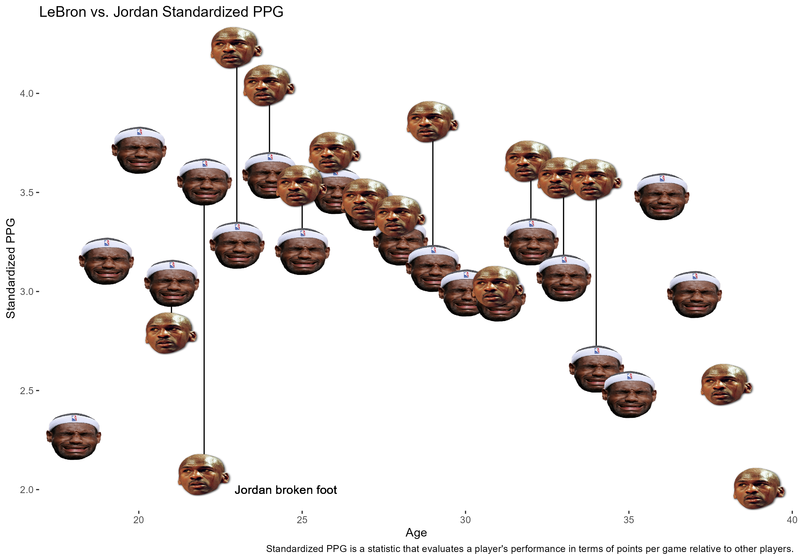
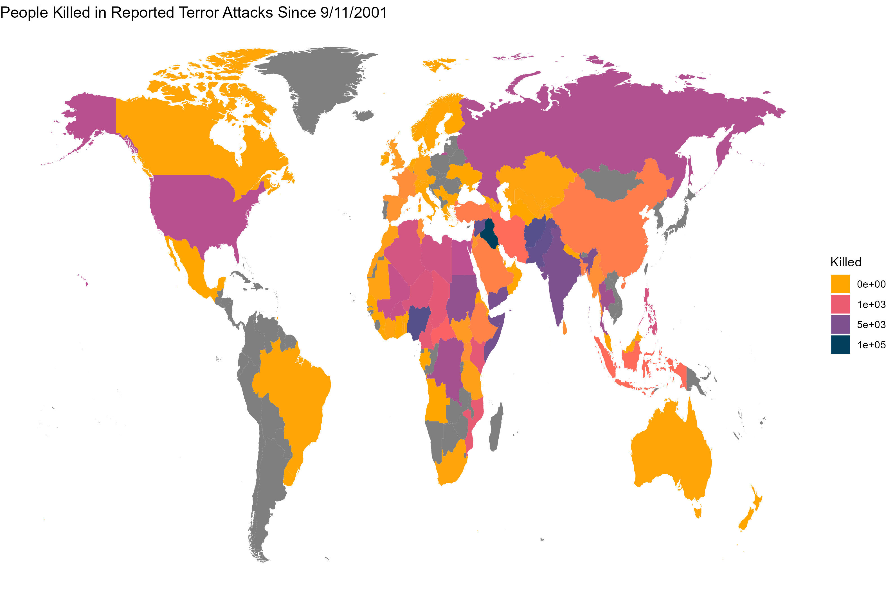

# Ryan Presnell's Data Analytics Portfolio
This portfolio contains some of my data analytics projects.

## Sports

### Stochastic Simulation of MLB Run Distributions for Batting Lineup Optimization

[Paper](MLBPaper.docx)

[Code]()

In this project, I explore the efficacy of (and make changes to) the stochastic model baseball proposed by numerous authors modeling of an inning with the goal of producing an effective means of testing one batting lineup over another.

### Testing the Limits of College Basketball Playoff Predictions

[Paper](College-Basketball-Analysis.docx)

[Code](College-Basketball-Analysis-Code.html)

Using data on college basketball teams such as offensive/defensive efficiency and power rating, I used machine learning algorithms such as KNN and Random Forest to make predictions including a re-prediction of the 2019 NCAA MBB tournament. Included is the 5-page paper with analysis & code file. 

## Misc.

### Credit Card Eligibility 

[PowerPoint](Credit-Card-Eligibility-PPT.pptx)

As of yet, this project is mostly a visualization project utilizing Tableau and the ggplot2 package in R; however, I did fit a couple of machine learning models but have had to switch gears and do not have much time to continue this project.

### Movie Reviews Sentiment Analysis

[Code & Discussion](reviews-sentiment-analysis.html)

I first scraped one positive & negative review for each of the top 250 rated imdb movies. I then utilized two modeling methods - the bag of words method & bigram method - in order to predict whether the reviews in the test data were positive or negative reviews. 
